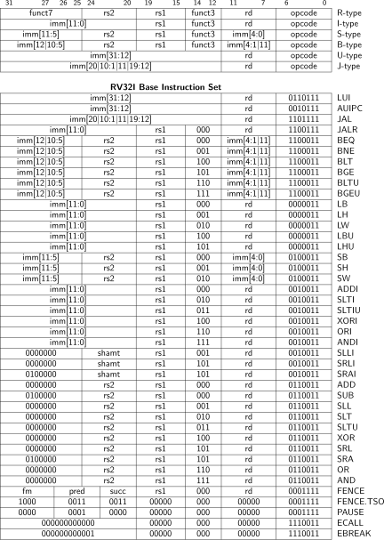
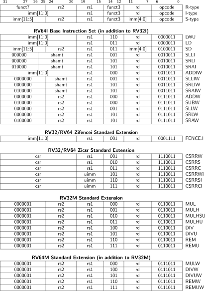
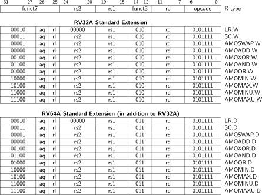
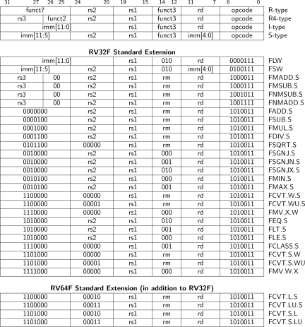
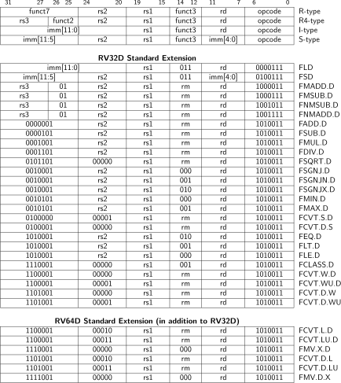
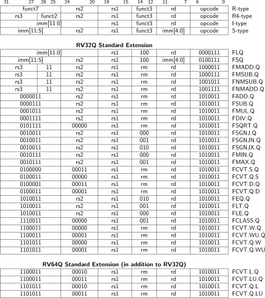
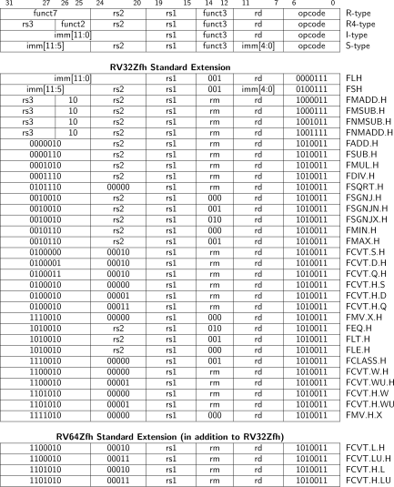

# RISC-V 规范参考

这是一个完整的RISC-V规范参考目录，包含关键的指令集图片、规范索引和在线资源链接。

## 目录结构

```
spec/
├── README.md           # 本文件（综合规范参考）
└── images/            # 关键图片目录
    ├── README.md      # 图片说明
    ├── instr-table_00.svg  # RV32I算术逻辑指令
    ├── instr-table_01.svg  # RV32I移位分支指令
    ├── instr-table_02.svg  # RV32I加载存储指令
    ├── instr-table_03.svg  # RV64I扩展指令
    ├── instr-table_04.svg  # M扩展乘除法指令
    ├── instr-table_05.svg  # A扩展原子操作指令
    └── instr-table_06.svg  # Zicsr扩展CSR指令
```

## 📊 指令集表格

本目录包含完整的RISC-V指令集表格，从[RISC-V指令集速查表](https://five-embeddev.com/riscv-user-isa-manual/Priv-v1.12/instr-table.html)下载：

### RV32I基础整数指令集


- 算术、比较、逻辑指令


- 移位、分支、跳转指令  


- 加载、存储、系统指令

### RV64I扩展指令集


- 64位加载存储、32位算术移位指令

### 扩展指令集


- 整数乘除法指令


- 原子内存操作指令


- 控制状态寄存器指令

## 核心规范文档

### 用户级ISA规范
- **RV32I基础整数指令集** - 基础算术、逻辑、分支、加载/存储指令
- **RV64I扩展指令集** - 64位扩展指令
- **M扩展（乘除法）** - 整数乘除法指令
- **A扩展（原子内存操作）** - 原子内存访问指令
- **Zicsr扩展（CSR指令）** - 控制状态寄存器访问指令
- **Zifencei扩展（FENCE.I）** - 指令获取屏障指令

### 特权级ISA规范
- **机器模式** - 最高特权级，处理异常和中断
- **监管者模式** - 操作系统级特权
- **控制状态寄存器** - 系统控制和状态信息
- **特权级指令** - 特权级操作指令

### 内存模型
- **RISC-V弱内存顺序模型** - 内存一致性模型
- **内存屏障指令** - FENCE指令

## 关键指令分类

### 算术指令
- ADD, ADDI, SUB, LUI, AUIPC
- SLT, SLTI, SLTU, SLTIU

### 逻辑指令
- AND, ANDI, OR, ORI, XOR, XORI

### 移位指令
- SLL, SLLI, SRL, SRLI, SRA, SRAI

### 分支指令
- BEQ, BNE, BLT, BGE, BLTU, BGEU

### 跳转指令
- JAL, JALR

### 加载/存储指令
- LB, LH, LW, LBU, LHU
- SB, SH, SW

### 系统指令
- FENCE, FENCE.I, ECALL, EBREAK
- CSRRW, CSRRS, CSRRC, CSRRWI, CSRRSI, CSRRCI

## 在线资源

### 官方规范文档
- [RISC-V指令集速查表](https://five-embeddev.com/riscv-user-isa-manual/Priv-v1.12/instr-table.html) - 完整的指令集参考
- [RISC-V官方规范](https://riscv.org/specifications/) - 官方规范文档

### 测试资源
- [RISC-V汇编器测试](https://github.com/riscv/riscv-tests)
- [RISC-V合规性测试](https://github.com/riscv/riscv-compliance)

## 使用说明

1. **指令集参考**: 查看本地图片或使用在线速查表
2. **规范验证**: 参考官方规范文档验证实现
3. **测试验证**: 使用官方测试套件验证功能

## 关键规范章节

### 用户级ISA
- RV32I基础整数指令集
- RV64I扩展指令集  
- M扩展（乘除法）
- A扩展（原子内存操作）
- Zicsr扩展（CSR指令）

### 特权级ISA
- 机器模式规范
- 监管者模式规范
- 控制状态寄存器
- 特权级指令

### 内存模型
- RISC-V弱内存顺序模型
- 内存屏障指令
